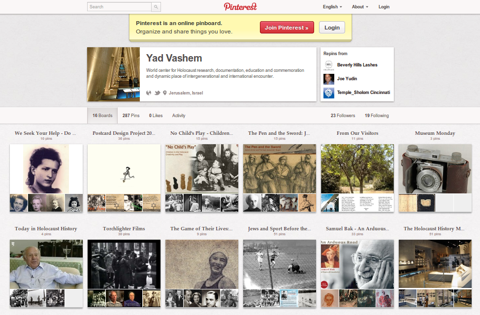

# Prolegomena

## So what about the Cloud?

* It`s a hype
* It's a buzzword (cloud = bullshit)[^1]
* Better know exactely what is referred to by "cloud"

*Which* notion of cloud do libraries refer to?

[^1]: to impress and persuade, unconcerned with falsehoods (Frankfurt, 2005)

## Three notions of the Cloud

----

![Infrastructure as a Service (IaaS)][construction]

---

![Platform as a Service (PaaS)][cubicals]

---

![Software as a Service (SaaS)][mcdonalds]

---

## Software as a Service (aka "web application")

* Software that you don't have to install or update. 
* Software that hides some of its complexity.

**Any software is inherently more complex then the task it 
  automates. Don't expect software to simplify anything!**

![][cloud]

# The importance of Data

## Data vs. Applications

![data][wine] \ ![application][fish] 

> "Data matures like wine, applications like fish"\
--- James Governor

## Data vs. *Applications*

![][fish]

* For immediate consumption
* Requirements and business logic change
    * Technical developments and trends
    * People's requirements change

## *Data* vs. Applications

![][wine] 
 
* Can be used in different context and times,
  if it is well done:
    * respect special properties of data
	* respect different notions of data

## Special properties of data

Bits can freely be rearranged. Eventually, data

* can be copied
* can be modified

very efficiently, without any traces or differences\
between "original" and "copy".

## Special properties of data

Digital Collections and descriptions of data are data again.

![][droste]

## Data challenges

This is where libraries are needed!

* Preservation
* Authenticity
* Provenance
* Identity

## Data challenges: Preservation

* All data needs a carrier
* Unsolved problem in general, but established discipline

## Data challenges: Authenticity

* Data modification leaves no traces
* Related to preservation but more about trust

## Data challenges: Provenance

* Data copy leaves no traces
* Digital signatures and trust (again)

## Data challenges: Identity

* A single bit changes the whole dataset
* Which modifications matter?

## Notions of data

* It's also a hype
* It's not a buzzword (data $\neq$ bullshit)[^3]
* Better know exactely what is referred to by "data"

*Which* notion of data do libraries refer to?

[^3]: Not primarily used to impress (but also used without care)

## Three notions of data[^4]

[^4]: As identified by Ballsun-Stanton (2012)

* Data as facts
* Data as subjective observations
* Data as communications

## Data as facts

* Hard numbers, product of reproducible measurements, scientific facts 
* Used to reveal (the real) world

![][periodictable]

## Data as facts in libraries

* Created by libraries
    * Holding counts
    * Patron information
    * Formal metadata
* Collected by libraries
    * research data

## Data as subjective observations

* Product of recorded observations, sense-impressions that must be filtered
* Used to construct (our) reality

![][telescope]

## Data as subjective observations in libraries

* Created by libraries
    * Subject indexing
    * User studies
    * Analysis of publication trends
* Collected by libraries
    * research data

## Data as communications

* Transferred or stored sign, a container of meaning in form of sequence of bits
* Used to describe (any) reality

![][matrix]

## Data as communications in libraries

digital objects, electronic resources, informational objects, electronic
publications, ..., **digital documents**

* Collected by libraries

## Data as communications/documents in libraries

A **document** is not information but a recorded "evidence in support of a fact"
(Briet, 1951),[^5] which can be any possible statement. This notion somehow got
lost in the history of library and information science / documentation
science (Ørom 2007).

* **Advice:** Don't mess with research data as facts or as observations but 
  treat them as documents, like other (digital) publications!

[^5]: See Buckland (1997,1998) for an introduction.

## The importance of data in libraries

* More and more communication and publication is digital.
* If libraries still care for documents, they have to
  care for data.

*Does your library actually care for data or is activity around data outsourced
to the "tech people"? Would you outsource any activity around books to the
"book people"?*

# The importance of Libraries

## What does a library do?

A library collects, arranges, and makes available (published) documents (among
other services) to meet user needs.

This should also apply to digital documents:

* **collect** data
* **arrange** data
* **make available** data

## Collect data

![Data needs care][winecellar]

----

![How many libraries store digital objects][regal]

## The eResource fallacy

If libraries license eResources to be accessed from publisher
sites, libraries are only temporary, intermediary retailers.

* **Advice:** Data that cannot be **copied and modifed** is lost. 
  Actually collect and process digital documents (or you won't be
  in the document business anymore)

## Why and how can libraries care for digital documents?

* Libraries are used to deal with documents (data as communications)
    * collect digital document
    * arrange digital documents
    * make available digital documents
* Libraries can respond to the **data challenges**, because of:
    * Trust
    * Neutrality
	* Persistence
* Ensure that documents can be used as data:
    * copying
	* modification

## Example: Collections

* Create and present your digital collections 
* in different forms on different platforms

----

<!--
----

-->

## Example: Annotations

One must be able to

* annotate your documents
* link to (parts of) it 
* to track changes when reusing it (revision control)

----

![][inkunabel]

----

[^n]

[^n]: Netline.org screenshot by David McClure with map tiles by Stamen Design, under CC BY 3.0, data by OpenStreetMap, under CC BY SA, maps from the Hotchkiss Map Collection at LoC

# Summary

## The situation

* Software is inherently complex and becomes obsolete
* Data ages less rapidly if it can be used in **different context and time**

*In the end all content will be digital -- get used to it!*

## Care for data!

> “Data that is loved tends to survive” 
--- Kurt Bollacker

* respect special properties of data
	* copying and modification must be possible
		* Be able to store whereever you like
		* Be able to transform to any form you like
		* Be able to combine with any data you like 
	* digital collections and metadata are also data
* respect different notions of data
	* focus on data as communications instead of 
	  digging into details of research data
* Provide solutions to the data challenges
    * preservation
	* authenticity
	* provenance
	* identity

## Where to start

* Collect digital publications!
	* Start archiving public websites, blogs, mailing lists etc.
	* Create and manage data/document repositories (see yesterday's talks)
    * Invest in preservation
    * Exchange digital documents with other libraries and initiatives
      (see following talk by Herbert van de Sompel, LOCKSS...)
* Provide data as accessible as possible (Open Data)
* Publish your own digital publications
* Allow annotating and connecting with your digital documents
    * simple access will not be the primary role of libraries 
    * Data needs to be usable in different context and times

# Appendices

## References

* Ballsun-Stanton, Brian (2012): Asking About Data: Exploring Different
  Realities of Data via the Social Data Flow Network Methodology. PhD thesis
* Briet, Suzanne (1951): Qu’est-ce que la documentation? Editions
  documentaires, industrielles et techniques
* Buckland, Michael (1997): What is a "document"? In: Journal of the American
  Society of Information Science (JASIST) 48.9, pp. 804–809
* Buckland, Michael (1998): What is a "digital document"? In: Document Numérique
  2.2, pp. 221– 230
* Frankfurt, Harry G. (2005). On Bullshit. Princeton University Press
* Ørom, Anders (2007): The concept of information versus the concept of
  document. In: Skare et al. (eds.) : Document (re)turn. Contributions from
  a research field in transition. pp. 53-72. Peter Lang

## Image Credits and licenses

All images from Wikimedia Commons:

* [construction.jpg](http://commons.wikimedia.org/wiki/File:Bucheimerwegrohbau.jpg)
  CC-0 by Schweinepeterle (Rolf H.) 	
* [cubicals.jpg](http://commons.wikimedia.org/wiki/File:Office-Cubicals-5205.jpg)
  CC-BY-SA by David R. Tribble 
* [mcdonalds.jpg](http://commons.wikimedia.org/wiki/File:MarkhamMcDonalds.JPG)
  CC-0 by Raysonho@Grid Engine
* [wine.jpg](http://commons.wikimedia.org/wiki/File:Old_French_wine.jpg)
  CC-BY-SA by Rafael Garcia-Suarez
* [fish.jpg](https://commons.wikimedia.org/wiki/File:Dead_fish_on_the_beach.jpg)
  CC-BY-SA by mahalie stackpole
* [periodictable.png](http://en.wikipedia.org/wiki/File:Periodic_table.svg)
  CC-0 by Cepheus
* [droste.jpg](http://commons.wikimedia.org/wiki/File:Droste_effect.jpg)
  CC-BY Zzubnik
* [winecellar.jpg](http://commons.wikimedia.org/wiki/File:Wine_cellar.jpg)
  CC-BY-SA by Che (Petr Novák)
<!-- * [cloud.jpg](http://commons.wikimedia.org/wiki/File:Я_за_камнем.jpg) -->
* [cloud.jpg](http://commons.wikimedia.org/w/index.php?oldid=31049014)
  CC-0 by Sidik iz PTU
* [regal.jpg](http://commons.wikimedia.org/wiki/File:Regał.jpg)
  CC-0 by Czarna Trucizna
* [telescope.jpg](http://commons.wikimedia.org/wiki/File:Caricatura_German_Riesco.jpg)
  CC-0 by C. Zorzi
* [tree.jpg](http://commons.wikimedia.org/wiki/File:Arbre_de_ligne_de_Marie-Charlotte_de_Bildstein.jpg)
  CC-BY-SA by Ji-Elle
* [twins.jpg](http://commons.wikimedia.org/wiki/File:Kessler_twins.JPG)
  CC-0 by William Morris Agency
* [earthquake.jpg](http://commons.wikimedia.org/wiki/File:Fukui_Earthquake_1948_-_damaged_building.jpg)
  CC-0 by Bert Cohen
* [vermeer.jpg](http://commons.wikimedia.org/wiki/File:Johannes_Vermeer_%281632-1675%29_-The_Girl_With_The_Pearl_Earring_%281665%29.jpg)
  CC-BY-SA Kunstkenner2305
* [clown.jpg](http://commons.wikimedia.org/wiki/File:Putrajaya_Hot_Air_Balloon_Fiesta_2009_-_Clown.jpg)
  CC-BY by Hamdan Zakaria

[cloud]: img/cloud.jpg
[construction]: img/construction.jpg
[cubicals]: img/cubicals.jpg
[droste]: img/droste.jpg
[fish]: img/fish.jpg

[inkunabel]: img/inkunabel.jpg
[matrix]: img/matrix.jpg

[mcdonalds]: img/mcdonalds.jpg
[periodictable]: img/periodictable.png
[regal]: img/regal.jpg
[telescope]: img/telescope.jpg
[winecellar]: img/winecellar.jpg
[wine]: img/wine.jpg

[librariesSE01]: img/librariesSE01.png
[librariesSE02]: img/librariesSE02.png

## Got questions? Just Ask!

![][librariesSE01]  ![][librariesSE02]

<http://libraries.stackexchange.com>

Q&A about libraries and information science

## This presentation as digital document

Source code and images of this presentation are available at
<https://github.com/jakobib/ticer2012> to be copied and modified
under CC-BY-SA license.

## Original data from libraries

* Data not used as documents:
    * facts: library data 
      (holdings, patrons, loans, formal metadata)
    * observations: subject metadata 
      (descriptions)
    * communication: your publications
* Can be used in other context and times 
	* Example: Authority files, connected via VIAF
    * Good use of data refers to you as source and authority
* **Advice:** Provide as much as possible your original data and documents.
   Just publish and care for this documents like any other acquisitions.

